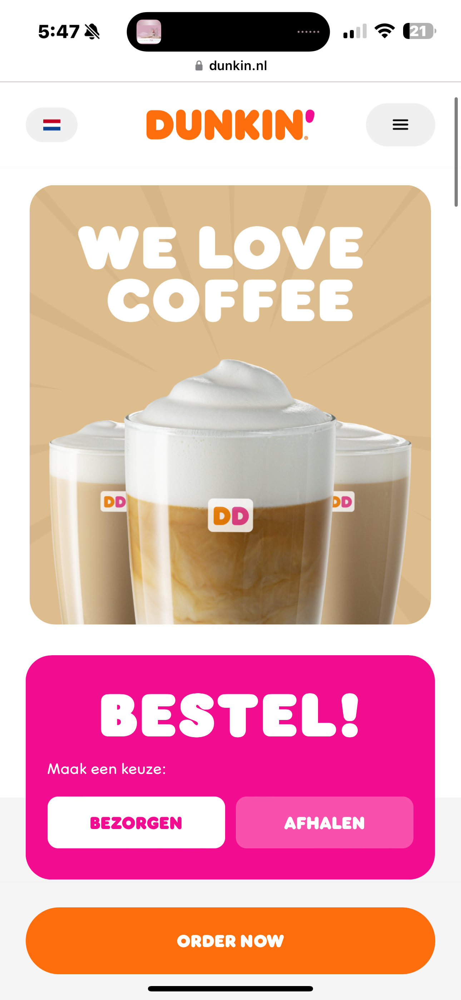
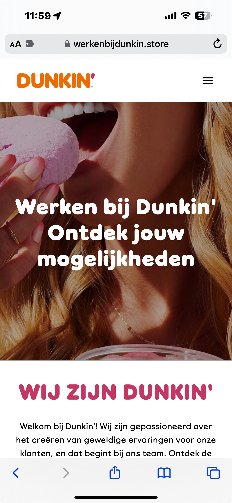
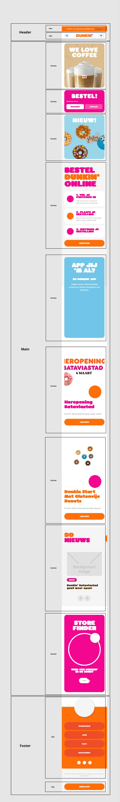
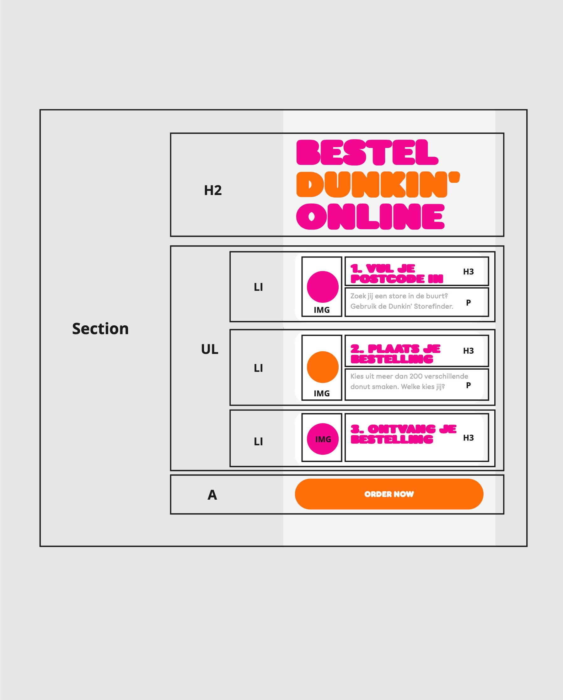
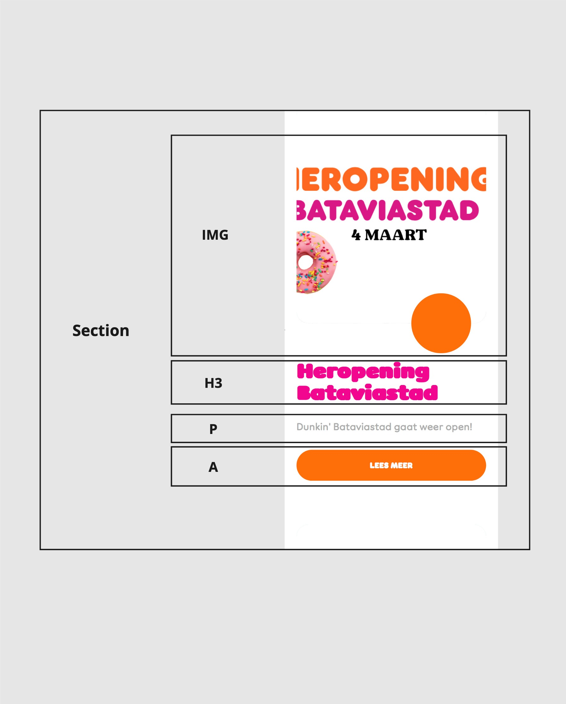
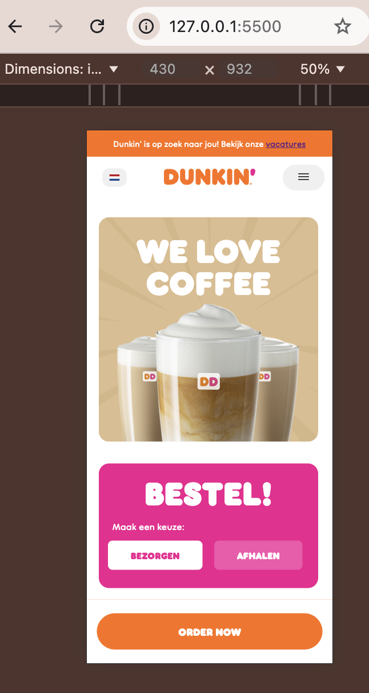
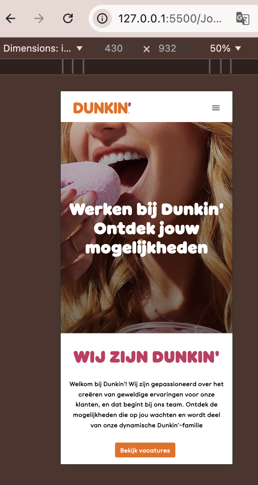
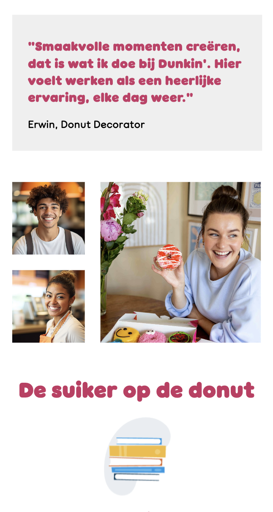
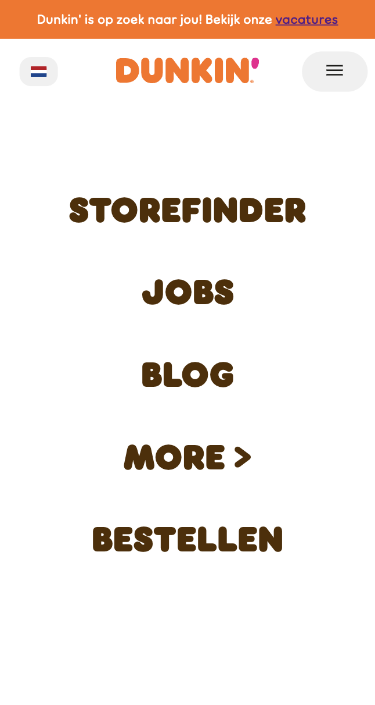

# Procesverslag
Markdown is een simpele manier om HTML te schrijven.  
Markdown cheat cheet: [Hulp bij het schrijven van Markdown](https://github.com/adam-p/markdown-here/wiki/Markdown-Cheatsheet).

Nb. De standaardstructuur en de spartaanse opmaak van de README.md zijn helemaal prima. Het gaat om de inhoud van je procesverslag. Besteedt de tijd voor pracht en praal aan je website.

Nb. Door *open* toe te voegen aan een *details* element kun je deze standaard open zetten. Fijn om dat steeds voor de relevante stuk(ken) te doen.

## Jij

  
uitwerken voor kick-off werkgroep

  ### Auteur:
  Rania Belhimer

  #### Je startniveau:
  Blauw

  #### Je focus:
  Surface
 

## Je website

  
uitwerken voor kick-off werkgroep

  ### Je opdracht:
  (https://www.dunkin.nl) (https://www.dunkin.nl/order-now)

  #### Screenshot(s) van de eerste pagina (small screen): 
  Home pagina  
  

  #### Screenshot(s) van de tweede pagina (small screen):
  Jobs pagina  
  
 

## Toegankelijkheidstest 1/2 (week 1)

  
uitwerken na test in 2e werkgroep

  ### Bevindingen  
      
      
    
    
   
  Lijst met je bevindingen die in de test naar voren kwamen:
 Over het algemeen ziet de website er goed uit, maar er zaten wel een paar errors in de HTML.
 Met de screenreader las het niet alles voor hoe het bedoelt was.

## Breakdownschets (week 1)

  
uitwerken na afloop 3e werkgroep

  ### de hele pagina: 
  

  ### dynamisch deel (bijv menu): 
  

  ### wellicht nog een dynamisch deel (bijv filter): 
  

## Voortgang 1 (week 2)

  
uitwerken voor 1e voortgang

  ### Stand van zaken
  Ik had al een flink stuk van mijn html af, nog niet alles maar zeker 90%. 
  Bij het hamburger menu liep ik wel echt vast.

  ### Verslag van meeting
  hier na afloop snel de uitkomsten van de meeting vastleggen

  - Het hamburger menu lukte bij veel mensen nog niet

## Voortgang 2 (week 3)

  
uitwerken voor 2e voortgang

  ### Stand van zaken
  Ik heb niet heel veel voortgang gemaakt deze week. 
  Ik heb alleen een klein begin van de css van de home page. 
  De header is niet hoe ik hem wil hebben.

  ### Verslag van meeting
  hier na afloop snel de uitkomsten van de meeting vastleggen

  - Hulp gekregen met hoe ik de kaart kan stijlen.
  - Hulp gekregen om de header zo te krijgen hoe ik hem wilde
  

## Toegankelijkheidstest 2/2 (week 4)

  
uitwerken na test in 9e werkgroep

  ### Bevindingen
     
      
      
      
    
 
  Lijst met je bevindingen die in de test naar voren kwamen (geef ook aan wat er verbeterd is):
  Over het algemeen ziet de website er goed uit, al zeg ik het zelf XD.
  Met de screenreader ging het nog niet optimaal, dat kan aan 3 dingen liggen; mijn website, mijn laptop, mijn screenreader skills. 

## Voortgang 3 (week 4)

  
uitwerken voor 3e voortgang

  ### Stand van zaken
  Ik loop echt best wat achter, dus ik moet nog heel veel doen (css en javascript).

  ### Verslag van meeting
  hier na afloop snel de uitkomsten van de meeting vastleggen

  - Feedback gekregen op hetgeen wat ik tot nu toe had.
  - Hulp gekregen met hoe ik de header nog kon verbeteren.
  - Tip gekregen over de "order now" knop die altijd zichtbaar is.

## Eindgesprek (week 5)

  
uitwerken voor eindgesprek

  ### Je uitkomst - karakteristiek screenshots:
  
  

  ### Dit ging goed/Heb ik geleerd: 
  Korte omschrijving met plaatjes
  Tot mijn verbazing was ik met de h1/background img van de jobs pagina vrij snel "klaar". Ik hoefde niet veel heen en weer om het resultaat te krijgen wat ik wilde. Ook de "foto gallerij" vind ik echt gode gelukt, al zeg ik het zelf XD. Ik vond img's positioneren eerst echt heel moeilijk maar door dit stukje sta ik mij al toch wat beter in mijn schoenen over foto's moeten positioneren.
  
 

  ### Dit was lastig/Heb ik geleerd:
  Korte omschrijving met plaatjes
  De animatie van het hamburger menu goed krijgen ging niet zonder vele pogingen. Ik vond het echt best moeilijk om in te schatten welke waarden ik moest geven om de animatie te laten lukken.
  

## Bronnenlijst

  
continu bijhouden terwijl je werkt

  Nb. Wees specifiek ('css-tricks' als bron is bijv. niet specifiek genoeg). 
  Nb. ChatGpT en andere AI horen er ook bij.
  Nb. Vermeld de bronnen ook in je code.

  1. https://validator.w3.org/
  2. https://jigsaw.w3.org/css-validator/
  3. https://www.a11yproject.com/checklist/
  4. https://codepen.io/shooft/pen/mdZpoKa
  5. https://codepen.io/shooft/pen/GRbyePL
  6. https://codepen.io/shooft/pen/ExBoMM
  7. https://codepen.io/shooft/pen/mdZpvNx
  8. https://codepen.io/shooft/pen/wvLjNPo?editors=0110
  9. https://codepen.io/shooft/pen/VwJowvJ?editors=1100
  10. https://mixkit.co/free-sound-effects/notification/
  11. https://www.w3schools.com/howto/howto_css_switch.asp
  12. https://tympanus.net/codrops/2024/01/17/a-practical-introduction-to-scroll-driven-animations-with-css-scroll-and-view/
  13. https://www.digitalocean.com/community/tutorials/css-cropping-images-object-fit
  14. https://developer.mozilla.org/en-US/docs/Web/HTML/Element/blockquote
  15. https://www.w3schools.com/tags/tag_blockquote.asp
  16. https://www.w3schools.com/tags/ref_pxtoemconversion.asp
  17. https://www.onlinewebfonts.com/download/ac415bee855b42915c6fb198747e34ac
  18. https://www.onlinewebfonts.com/download/4ba6a0aa699286a040c28bf72ea53fa3
  19. https://chatgpt.com/share/66f8eb97-6f90-800e-85c4-8a712f6c7051
  20. https://chatgpt.com/share/66f8ec5f-86f4-800e-b0af-6616c40f24ab
  21. https://chatgpt.com/share/66f8e9c5-7250-800e-b322-f2dd197d0c7e
  22. https://www.svgrepo.com/svg/421558/burger-menu

